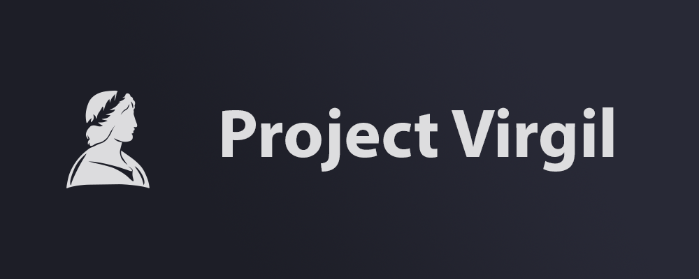

# Project Virgil | Last docs update: 03/12/2023 (d/m/y)

 
 

  <a href="#what-is-projectvirgil-">What is ProjectVirgil</a> •
  <a href="#the-structure-%EF%B8%8F--to-update-sorry-">The structure</a> 

## What is ProjectVirgil 📋
The project Virgil is a "small" project format by more part
 
- **The main software the** [VirgilAI](https://github.com/Retr0100/VirgilAI) 🤖
- **The dedicated** [Android mobile app](https://github.com/Retr0100/VirgilApp) 📱
- **The [website](https://projectvirgil.net) created to introduce people to the project** 🌐
- **A [status page](https://status.projectvirgil.net) for monitoring the status of all service ([rep](https://github.com/ProjecVirgil/Virgil-StatusPage))**
- **SOON** 💜

But this is only the FRONT of the project but the back of project is:

- **The [API](https://github.com/Retr0100/VirgilAPI) created to enable communication between the app and the software desktop** 🐝
- **The ANALISYS of [ML](https://github.com/Retr0100/VirgilML) only for the comprension of phrase in Virgil**
- **SOON** 💜

Project Virgilio represents an ambitious step forward in the era of virtual assistance, combining an intuitive interface, a state-of-the-art application and a powerful API to provide innovative and customised solutions to users worldwide.

#

**RELESEAS** 🔝

           

## RoadMap 📈

- [x] Virgil AI (Assistent Virtual)
- [X] Virgil APP (App dedicated a Virigil)
- [X] Virgil APIS (App dedicated at the connection to app from VirgilAI)
- [x] Virgil ML (Model dedicated at virgil)
- [X] Virgil WebSite (Virgil dedicated website)
- [X] Virgil Status-Page (Status page for monitoring the status of service)
- [ ] Virgil API (Virgil dedicated API for interaction)
- [ ] Virgil Discord (Bot with VirgilAI integreted)
- [ ] Virgil Mobile integration

#
The combination of all this creates the ProjectVirgil.The aim of this project is to create a kind of completely open source and customisable ecosystem by trying to make the basic experience as simple and understandable as possible. 

## The structure 🏗️ | to update sorry 🙏 

 

## Component ⚙️

 

## Notes
### In this paragraph I will add secondary items or updates released
- Soon the ***[CATONE](https://www.babelmatrix.org/works/it/Dante%2C_Alighieri-1265/La_Divina_Commedia._Purgatorio._Canto_I./en/4208-The_Divine_Comedy.__Purgatorio._Canto_I.) UPDATE*** (Purgatory chant I vv-61 to vv-66) 🗻

## Other

As mentioned above, VirgililAI is part of a larger project that includes an app, a website and others, the links of which are at Project:

### [Website](https://projectvirgil.net)

### [Mobile APP](https://github.com/Retr0100/VirgilApp)

### [Analysis of ML](https://github.com/Retr0100/VirgilML)

## Credits

The project is made by one person and is still in development, I'm looking for someone to give me advice and a hand to continue the project, which I believe is an excellent open source and free alternative to devices like Alexa or Google Home.

### Contact me

For code related issues you can use github directly for other collaborations or alerts write to this email <projectvirgilai@gmail.com>

If you want to support a small developer take a [**special link**](https://www.paypal.me/Retr0jk)

